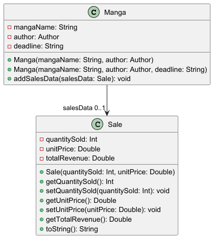
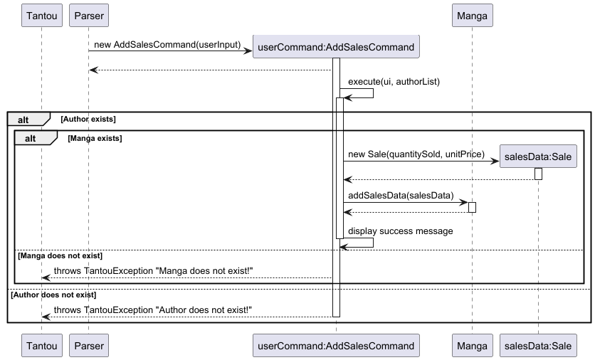
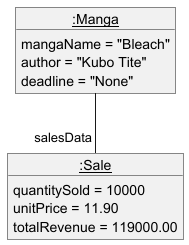
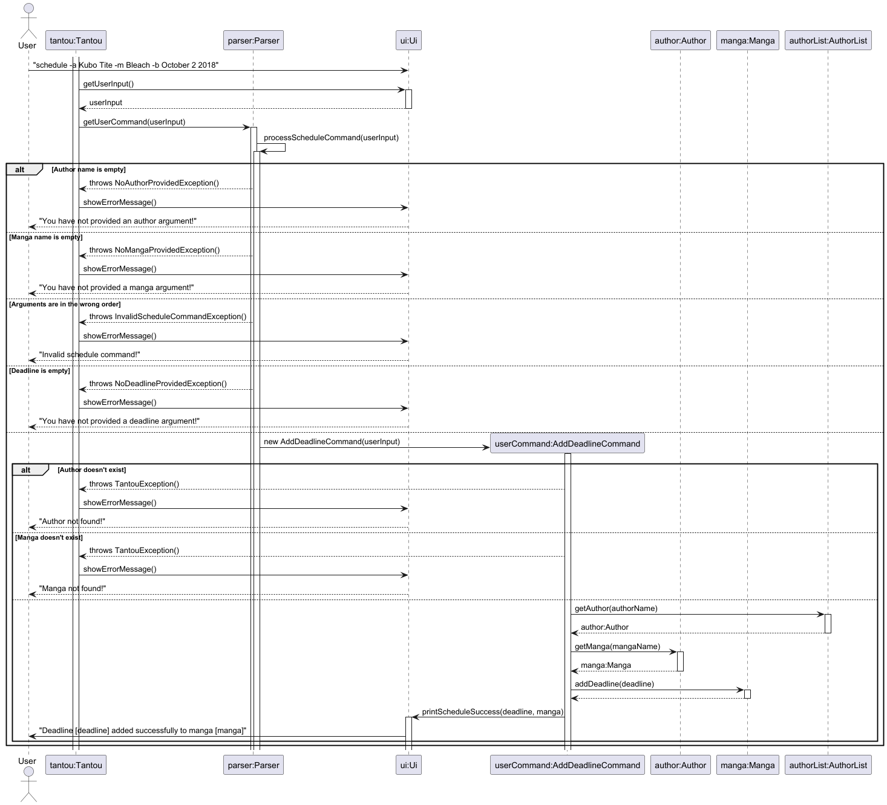
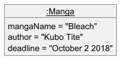

# Developer Guide for MangaTantou

# Acknowledgements
MangaTantou's structure has been greatly inspired by the team developers' respective iPs as listed below:
1. [Donovan](https://github.com/xenthm/ip)
2. [Sarah](https://github.com/sarahchow03/ip)
3. [Ian](https://github.com/iaso1774/ip)
4. [Andy](https://github.com/averageandyyy/ip)

The following third-party libraries were used:
- [Gson 2.11.0](https://github.com/google/gson): A Java library for converting Java objects to JSON and vice versa, licensed under Apache License 2.0.

Additionally, the following resources/websites were heavily used (they are amazing): 
- [RegExr](https://regexr.com/): RegExr is an online tool to learn, build, & test Regular Expressions (RegEx / RegExp).
- [Regex Vis](https://regex-vis.com/): Regex visualizer and editor. 
- [RegEx101 ](https://regex101.com/): Regex visualizer,editor, and debugger.  
- [Ashley's PlantUML Doc](https://plantuml-documentation.readthedocs.io/): Documentation about how to use the commands, keywords, options, and other information needed to produce diagrams with PlantUML. 

# Design & implementation
{Describe the design and implementation of the product. Use UML diagrams and short code snippets where applicable.}

## Overall Architecture
### Representing Data in MangaTantou
<br/>
The above UML class diagram shows the overall structure of author and manga data an editor using MangaTantou would be interested in. 

> **_NOTE:_** There is circular reference (bidirectional navigability) between `Author` and `Manga` through `MangaList`. 

### Commands 
<br/>
The current list of viable `Commands` are as follows:
1. `AddAuthorCommand`
2. `AddMangaCommand`
3. `DeleteAuthorCommand`
4. `DeleteMangaCommand`
5. `ViewAuthorsCommand`
6. `ViewMangasCommand`
7. `AddSalesCommand`
8. `GreetCommand`
9. `ByeCommand`

#### Command Structure
All child `Command` classes must inherit from the abstract `Command` class. Each child class is required to implement the abstract `execute` method.

While child classes may or may not modify the `AuthorList`, they are encouraged to utilize the `Ui` class to interact with users, such as displaying success messages.

#### Guidelines for Future Developers
When adding new command classes, developers must follow the same method of implementation by 
inheriting from the abstract `Command` class. Ensure that each new command class includes 
an implementation of the `execute` method and appropriately interacts with the `Ui` class 
for user feedback. Additionally, developers should update the `Parser` class to gather the 
relevant arguments from the user for their commands.

### Saving Data
`AuthorList` data accumulated by the user can be saved with the provided `Storage` and `StorageHelper` classes. 

#### Storage Structure
<br/>
The above UML class diagram outlines the structure of the classes related to saving data. 

The `Storage` class uses the Singleton design pattern, which means only a maximum of one `Storage` instance can exist during the program's lifespan. To access it, call the static method `Storage::getInstance`. 

The `StorageHelper` utility class wraps the methods to access `Storage` for ease of use.

Data is by default stored in a JSON file `catalog.json` in the `data` directory at the program root location. This can be changed via the `public static final String DATA_PATH` constant in the `Storage.java` file. 

The class makes use of the `Gson` third-party library to de/serialize data. 

When needed, call `StorageHelper::readFile` to return the deserialized `AuthorList` from `catalog.json`. 

Whenever a user action that modifies the state of the `AuthorList` is performed, the corresponding overridden `Command::execute` method should call `StorageHelper.saveFile(authorList: AuthorList)` after modifying the data.     

#### Storage Behaviour
The following UML sequence diagrams outline the behaviour of the program when the user inputs a command that modifies the `AuthorList`.
<br/>
<br/>
<br/>

#### Gson De/serialization
Instead of using the default deserializers provided by `Gson`, this project defines custom ones. This enables us to perform checks on the key-value pairs in the data file every step of the way, providing detailed and relevant information in the event deserialization is not successful. The following is a code snippet showcasing the checks performed during the deserialization of data. 
```
@Override
public MangaList deserialize(JsonElement json, Type typeOfMangaList, JsonDeserializationContext context)
        throws JsonParseException {
    // Ensure mangaList is a JSON array
    if (json == null || !json.isJsonArray()) {
        throw new JsonParseException("corrupt MangaList object");
    }
    JsonArray mangaListJsonArray = json.getAsJsonArray();

    MangaList mangaList = new MangaList();
    for (JsonElement mangaJsonElement : mangaListJsonArray) {
        // Ensure manga is valid, skipping if not
        try {
            // pass Author reference
            Manga manga = new MangaDeserializer(author).deserialize(mangaJsonElement, Manga.class, context);
            mangaList.add(manga);
        } catch (JsonParseException e) {
            System.out.println("Author "
                    + author.getAuthorName()
                    + ": skipping corrupted manga entry due to "
                    + e.getMessage()
            );
        }
    }

    // Assertion: mangaList is either empty, or contains only valid mangas
    return mangaList;
}
```

Additionally, to prevent infinite recursion due to the circular reference between an `Author` and their `Manga` (stemming from bidirectional navigability; refer to [Representing Data in MangaTantou](#representing-data-in-mangatantou)
, a custom `@ExcludeInSerialization` annotation was created to signal to `Gson` to ignore the annotated class attribute when serializing the data. The following is a code snippet demonstrating how the `author` field is excluded in the `Manga` class.
```
public class Manga {
    private String mangaName;
    @ExcludeInSerialization
    private Author author;
    private String deadline;
    private Sale salesData;
    
    ...
}
```

#### Errors in Data File
```
[
  {
    "authorName": "test1",
    "mangaList": [
      {
        "mangaName": "manga 1-1",
        "deadline": "None"
      },
      {
        "mangaName": "manga 1-2",
        "deadline": 31415
      }
    ]
  }
]
```
When providing the above `catalog.json` file and inputting `view -a test1`, the following output is given. 
```
Author test1: skipping corrupted manga entry due to corrupt deadline
Data restored!
Wake up and slave~
view -a test1
Mangas authored by test1, Total: 1
no. | Manga Name
----------------------------------------------
  1 | manga 1-1
```
As observed, the `deadline` of `manga 1-2` is invalid. Instead of discarding the whole data file and starting with an empty `AuthorList`, the deserializer skips `manga 1-2` altogether and tries to deserialize the rest. 

This allows the user to manually edit their `catalog.json` file with peace of mind that the program can catch their errors.

### Displaying Data
`AuthorList` data can be displayed with [view commands](#view-command). The `Ui` class aids in presenting readable data to the user.

#### Ui Structure
<br/>
The above UML class diagram outlines the structure of the `Ui` and related classes. 

The `PrintColumn<T>` class represents the table columns to be printed. It contains attributes that help with the formatting of a table column, such as width, header name, and a reference to getter methods (also known as `valueProvider`s) in the `Author` and `Manga` data classes that return `String`s. Default values for these attributes are provided in `PrintFormat.java` in the `constants` package. 

Within the `PrintColumn<T>` class, methods format the values provided by the data class (`Author`, `Manga`, etc.) with `String::format` (which is similar to `printf` in C/C++) into fixed-width columns. 

With the list class that comprises instances of the data class (e.g. `AuthorList`, `MangaList`), a static method (e.g. `MangaList::mangaColumnsToPrint`) is provided to get the print configuration for the data class given the argument flags passed in the method. It returns an `ArrayList` of `PrintColumn<T>`s configured based on what data should be in the column. 

This static method should be called in the corresponding view `Command::execute` method, similar to the following form: `Ui.printList(mangaList, mangaColumnsToPrint(...));`. 

Refer to [the view command interaction](#view-command-interaction) for an example walkthrough of the methods mentioned in this section. 

## Interacting with the user
### AddAuthorCommand
#### Overview
The `AddAuthorCommand` is responsible for adding new `Author`s to `Tantou`. The command creates a new `Author` instance and verifies its existence. If it
is a new and undocumented `Author`, it is then added to `Tantou`'s `AuthorList`, allowing the user to keep track
of their manga authors. The `AuthorList` is saved via `Storage` for data persistency.
#### Interaction
The following diagram illustrates the interactions that take place when the
user provides `"catalog -a Kubo Tite"` as an input.
<br/><br/>
If the `Author` instance already exists, a `TantouException` is thrown, informing the user that
they are already tracking this employee.

### AddMangaCommand
#### Overview
The `AddMangaCommand` is responsible for adding new `Manga`s to `Author`s in `Tantou`. The command first creates a new `Author` and `Manga` instance.
If the newly created `Author` is undocumented by `Tantou`, the `Author` is added to the `AuthorList` and the newly created `Manga` is added to
the `Author`'s `MangaList`. If the `Author` already exists, `Tantou` will check for the existence of the newly created `Manga`. If there is an existing
association between the `Manga` and `Author`, a `TantouException` is thrown, informing the user that they are adding an existing `Manga`. Otherwise,
the `Manga` is similary added to the `Author`'s `MangaList` and the current state of `AuthorList` is saved via `Storage` for
data persistency.
#### Interaction
The following diagram illustrates the interactions that take place when the
user provides `"catalog -a Kubo Tite -m Bleach"` as an input.
<br/><br/>

### DeleteAuthorCommand
#### Overview
The `DeleteAuthorCommand` is responsible for removing `Author`s from `Tantou`. The command creates a new `Author` instance and verifies its existence. If it
is a new and undocumented `Author`, a `TantouException` is thrown, informing the user that this `Author` does not exist and hence cannot be removed.
Otherwise, the `Author` is removed from the `AuthorList`, which is then saved via `Storage` for data persistency.
#### Interaction
The following diagram illustrates the interactions that take place when the
user provides `"catalog -a Kubo Tite -d"` as an input.
<br/><br/>

### DeleteMangaCommand
#### Overview
The `DeleteMangaCommand` is responsible for removing `Manga`s from `Author`s in `Tantou`. The command first creates a new `Author` and `Manga` instance.
If the newly created `Author` is undocumented by `Tantou`, a `TantouException` is thrown, informing the user that this `Author` does not exist and the `Manga` cannot be removed.
If the `Author` instead exists, `Tantou` will check for the existence of the newly created `Manga`. If there is no existing
association between the `Manga` and `Author`, a `TantouException` is thrown, informing the user that they are deleting a non-existing `Manga`. Otherwise,
the `Manga` is removed from the `Author`'s `MangaList` and the current state of `AuthorList` is saved via `Storage` for
data persistency.
#### Interaction
The following diagram illustrates the interactions that take place when the
user provides `"catalog -a Kubo Tite -m Bleach -d"` as an input.
<br/><br/>

### View Command
#### Overview
The `ViewAuthorsCommand` and `ViewMangasCommand` are responsible for displaying a list of the various data entries in `AuthorList`. Using the [`Ui` class](#displaying-data), it formats the data into a table. 

For example, `view -a test1 -b -s` gives the following output (`b` for by-date/deadline, `s` for sales data). 
```
view -a test1 -b -s
Mangas authored by test1, Total: 2
no. | Manga Name                               | Deadline             | Unit Price | Units Sold | Revenue
-----------------------------------------------------------------------------------------------------------------
  1 | manga 1-1                                | None                 | N/A        | N/A        | N/A
  2 | manga 1-2                                | None                 | N/A        | N/A        | N/A
```


<h4 id="view-command-interaction">
Interaction
</h4>

The following UML sequence diagrams illustrate the interactions that take place when the user provides a valid `ViewMangasCommand` command (e.g. `view -a test1 -b -s`, where `test1` is an author that already wrote some manga).
<br/><br/>
<br/>
<br/>
`ViewAuthorsCommand` works similarly, but with only 2 required columns to print (row number and author name). 

### AddSalesCommand
#### Overview
The AddSalesCommand is responsible for adding sales data to a Manga. The Sale data consists of three attributes: `quantitySold`, `unitPrice` and `totalRevenue`. The `quantitySold` and `unitPrice` are inputs from the user, while `totalRevenue` is calculated by multiplying y`quantitySold` and `unitPrice`.

For the AddSalesCommand to be successful, the manga that the sales data is associated with must exist. If the `sales`
command is successful, the `Sales` data is then saved via Storage.
<br/><br/>

#### Interaction
The following sequence diagram illustrates the interactions that occur when the parser creates a new `AddSalesCommand`.
<br/><br/>

The following object diagram illustrates object structure after the above interaction is successfully run
with the input `sales -a Kubo Tite -m Bleach -q 10000 -p 11.90`.
<br/><br/>

### AddScheduleCommand
#### Overview
AddScheduleCommand changes the deadline on a specified manga. The deadline is kept as a String attribute `deadline`. This is set to `"None"` by default when a manga is created.

When using AddScheduleCommand, if the manga or author inputted don't exist, they are automatically created.

### Interaction

The following sequence diagram illustrates the interactions that occur when the parser creates a new `AddScheudleCommand`.

<br/><br/>

The following object diagram illustrates object structure after the above interaction is successfully run
with the input `schedule -a Kubo Tite -m Bleach -b October 2 2018`.
<br/><br/>

## Product scope
### Target user profile

{Describe the target user profile}

### Value proposition

{Describe the value proposition: what problem does it solve?}

## User Stories

|Version| As a ... | I want to ... | So that I can ...                                             |
|--------|----------|---------------|---------------------------------------------------------------|
|v1.0|editor of a manga company|add authors to a list| keep track of my authors and potentially their work progress. |
|v1.0|editor|add mangas to their respective authors| keep track of what each of my authors are working on.         |
| v1.0    | editor                 | delete authors under my charge                 | discharge under-performing authors under my charge       |
| v1.0    | editor                 | delete mangas under an author                  | discontinue a series that is unpopular with the audiences |
| v2.0    | business-minded editor | add the quantity of copies sold for a manga    | track the manga's popularity amongst audiences           |
| v2.0    | business-minded editor | add the unit price of each copy sold for manga | calculate the revenue earned by the series               |
| v2.0    | editor                 | delete the quantity and unit price for a manga | reset the sales data from the manga                      |

## Non-Functional Requirements

{Give non-functional requirements}

## Glossary

* *glossary item* - Definition

## Instructions for manual testing

{Give instructions on how to do a manual product testing e.g., how to load sample data to be used for testing}
